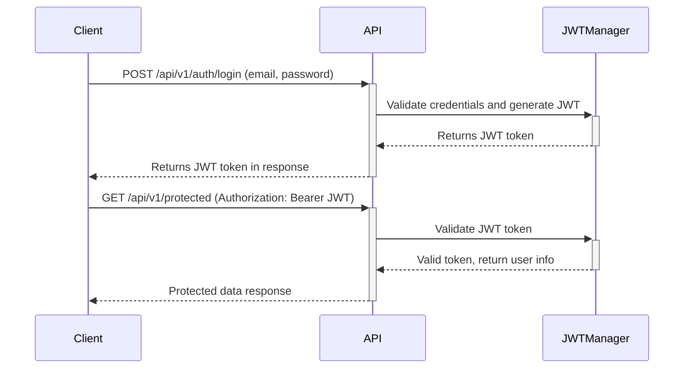

### Tâche : Implémenter l'authentification JWT avec `flask-jwt-extended`

#### Objectif
Mettre en place une authentification basée sur JWT pour l'application HBnB, permettant une fonctionnalité de connexion sécurisée. Cette tâche implique la configuration de l'API pour générer et vérifier les tokens JWT en utilisant l'extension `flask-jwt-extended`. Les tokens seront émis lors d'une connexion réussie et seront nécessaires pour accéder aux points de terminaison protégés.

#### Contexte
JWT (JSON Web Token) permet une authentification sécurisée en fournissant un token que les clients peuvent utiliser pour accéder aux ressources protégées sans avoir à se ré-authentifier à chaque requête. JWT est sans état, ce qui signifie que le serveur n'a pas besoin de stocker les sessions utilisateur, le rendant idéal pour les applications évolutives. Les tokens JWT permettent également d'intégrer des revendications supplémentaires (comme les rôles d'utilisateur), ce qui est utile pour l'autorisation.

Dans cette tâche, nous allons mettre en place la connexion des utilisateurs, émettre des tokens JWT et utiliser ces tokens pour protéger des points de terminaison spécifiques de l'API.

Voici un **diagramme Mermaid.js** qui montre l'interaction entre le client et l'API pour obtenir un token JWT et l'utiliser pour faire des requêtes authentifiées :

##### Ajout d'un Middleware
Dans Flask, un **middleware** est un logiciel qui se situe entre la requête et le traitement final de cette requête par vos routes Flask. Le middleware peut manipuler les requêtes, les réponses, ou les deux. Dans le contexte de l'authentification JWT, le middleware est responsable de la vérification du token JWT avec chaque requête entrante.

Flask-JWT-Extended fournit des décorateurs comme `@jwt_required()` qui agissent comme middleware, assurant qu'un token valide est présent avant d'autoriser l'accès aux ressources protégées.

- **Que fait le middleware dans JWT ?** : Le middleware intercepte la requête et vérifie si le token est présent et valide. Si le token est invalide ou manquant, le middleware empêche la requête d'atteindre le gestionnaire de route et renvoie à la place une réponse d'erreur.

- **Comment Flask-JWT-Extended gère-t-il cela ?** : Flask-JWT-Extended utilise des décorateurs tels que `@jwt_required()` et `@jwt_optional()`. Ces décorateurs s'assurent que les routes protégées ne sont accessibles que si l'utilisateur a un token valide.



Ce diagramme de séquence visualise le flux où :

1. **Requête de connexion du client** :
   - Le client initie le processus de connexion en envoyant une requête `POST` au point de terminaison de l'API (`/api/v1/auth/login`). Dans la requête, le client fournit les identifiants de l'utilisateur (email et mot de passe).

2. **API et génération du token JWT** :
   - L'API vérifie les identifiants fournis, et s'ils sont valides, l'API utilise le **JWTManager** pour générer un JWT (JSON Web Token). Ce token est une représentation sécurisée de l'identité de l'utilisateur, contenant des revendications comme `is_admin` et un temps d'expiration.

3. **Réponse du token JWT** :
   - L'API répond au client avec le token JWT généré. Le token est envoyé dans le corps de la réponse et est utilisé par le client pour authentifier les futures requêtes API.

4. **Le client fait des requêtes authentifiées** :
   - Après avoir obtenu le token JWT, le client envoie une autre requête à un point de terminaison protégé (par exemple, `GET /api/v1/protected`). Cette fois, la requête inclut le token dans l'en-tête `Authorization` sous la forme `Bearer JWT_TOKEN`.

5. **Validation du token JWT** :
   - L'API utilise le **JWTManager** pour valider le token. Si le token est valide (non expiré, non altéré, ou non révoqué), l'API procède au traitement de la requête.

6. **Accès aux ressources protégées** :
   - Après une validation réussie, l'API renvoie les données protégées. Si le token est invalide ou expiré, l'API répond avec un message d'erreur, souvent une réponse `401 Non autorisé`.

Voici la suite de la traduction en français du texte, en conservant les codes et termes techniques en anglais :

#### Instructions

1. **Installer la bibliothèque `flask-jwt-extended`**
   - Dans votre fichier `requirements.txt`, ajoutez la ligne suivante :
     ```
     flask-jwt-extended
     ```
   - Exécutez la commande suivante pour l'installer :
     ```bash
     pip install flask-jwt-extended
     ```

2. **Configurer JWT dans l'application Flask**
   - Dans le fichier `app/__init__.py`, importez et instanciez la classe `JWTManager` fournie par `flask-jwt-extended` pour activer la gestion JWT dans votre application Flask.
     ```python
     from flask_jwt_extended import JWTManager
     jwt = JWTManager()
     ```
   - Dans la fonction `create_app()`, enregistrez le middleware avec l'instance de l'application.
     ```python
     def create_app(config_class=config.DevelopmentConfig):
         # Code existant avec l'instance Flask app
         # ...
         jwt.init_app(app)
     ```

   > [!IMPORTANT]
   > Le `flask-jwt-extended` utilise une clé stockée dans [`JWT_SECRET_KEY`](https://flask-jwt-extended.readthedocs.io/en/stable/options.html#JWT_SECRET_KEY) pour signer de manière sécurisée le cookie de session.
   > Dans ce projet, nous allons utiliser la [SECRET_KEY](https://flask.palletsprojects.com/en/stable/config/#SECRET_KEY) de Flask que nous avons déjà définie dans la Classe de Configuration et qui peut également être utilisée par le plugin.

3. **Créer un point de terminaison de connexion (`POST /api/v1/login`)**
   - Le point de terminaison de connexion authentifiera l'utilisateur, générera un token JWT et le renverra au client. Le token inclura l'`id` de l'utilisateur et la revendication `is_admin` pour différencier les utilisateurs réguliers des administrateurs.
   - Dans `api/v1/auth.py`, créez le point de terminaison suivant :
     ```python
     from flask_restx import Namespace, Resource, fields
     from flask_jwt_extended import create_access_token
     from app.services import facade

     api = Namespace('auth', description='Opérations d'authentification')

     # Modèle pour la validation des entrées
     login_model = api.model('Login', {
         'email': fields.String(required=True, description='Email de l'utilisateur'),
         'password': fields.String(required=True, description='Mot de passe de l'utilisateur')
     })

     @api.route('/login')
     class Login(Resource):
         @api.expect(login_model)
         def post(self):
             """Authentifier l'utilisateur et renvoyer un token JWT"""
             credentials = api.payload
             # Obtenir l'email et le mot de passe de la charge utile de la requête
             # Étape 1 : Récupérer l'utilisateur basé sur l'email fourni
             user = facade.get_user_by_email(credentials['email'])
             # Étape 2 : Vérifier si l'utilisateur existe et si le mot de passe est correct
             if not user or not user.verify_password(credentials['password']):
                 return {'error': 'Identifiants invalides'}, 401
             # Étape 3 : Créer un token JWT avec l'id de l'utilisateur et le drapeau is_admin
             access_token = create_access_token(identity={'id': str(user.id), 'is_admin': user.is_admin})
             # Étape 4 : Renvoyer le token JWT au client
             return {'access_token': access_token}, 200
     ```

   **Explication :**
   - `create_access_token` : Cette fonction génère un token JWT. Le token inclut une **identité**, qui dans ce cas est un dictionnaire contenant le `user.id` et le drapeau `is_admin`. Cela permet au token de transporter des revendications que nous pourrons utiliser plus tard pour l'autorisation.
   - **Revendications du token** : En ajoutant des revendications comme `id` et `is_admin` au token, nous pouvons intégrer des informations sur l'identité et les permissions de l'utilisateur dans le token lui-même. Ainsi, nous n'avons pas besoin d'interroger la base de données pour chaque requête pour vérifier si un utilisateur est administrateur.

   **Détail des étapes :**
   - **Étape 1** : Récupérer l'utilisateur par email en utilisant la méthode `get_user_by_email` de `HBnBFacade`. Cette méthode interrogera le référentiel (en mémoire ou base de données, selon la partie du projet) pour un utilisateur avec l'email fourni.
   - **Étape 2** : Utiliser la méthode `verify_password` (qui devrait avoir été implémentée dans le modèle `User`) pour vérifier si le mot de passe fourni correspond au mot de passe haché stocké dans le référentiel.
   - **Étape 3** : Si les identifiants sont valides, générer un token JWT avec la fonction `create_access_token`. Nous intégrons le `user.id` et le drapeau `is_admin` comme partie des revendications du token, nous permettant d'identifier l'utilisateur et son rôle dans les requêtes suivantes.
   - **Étape 4** : Renvoyer le token généré au client dans le corps de la réponse. Ce token peut être utilisé par le client pour authentifier les futures requêtes.

4. **Protéger les points de terminaison avec JWT**
   - Une fois le JWT généré, vous pouvez protéger les points de terminaison sensibles de l'API en exigeant que l'utilisateur inclue le token dans l'en-tête `Authorization` de sa requête. Utilisez le décorateur `@jwt_required()` pour appliquer cela.
   Exemple :
     ```python
     from flask_jwt_extended import jwt_required, get_jwt_identity

     @api.route('/protected')
     class ProtectedResource(Resource):
         @jwt_required()
         def get(self):
             """Un point de terminaison protégé qui nécessite un token JWT valide"""
             current_user = get_jwt_identity()
             # Récupérer l'identité de l'utilisateur à partir du token
             return {'message': f'Bonjour, utilisateur {current_user["id"]}'}, 200
     ```

   **Explication :**
   - **@jwt_required()** : Ce décorateur garantit que le point de terminaison ne peut être accédé que si un JWT valide est fourni dans la requête. Si le token est manquant ou invalide, la requête sera rejetée.
   - **get_jwt_identity()** : Cette fonction extrait l'identité (dans ce cas, les revendications `user.id` et `is_admin`) du token. Nous pouvons ensuite utiliser ces informations pour personnaliser les réponses ou appliquer un accès basé sur les rôles.

5. **Tester le flux d'authentification**
   Utilisez `curl` pour tester la fonctionnalité de connexion et d'authentification :

   **Connexion et obtention du JWT :**
   ```bash
   curl -X POST "http://127.0.0.1:5000/api/v1/auth/login" -H "Content-Type: application/json" -d '{ "email": "john.doe@example.com", "password": "votre_mot_de_passe" }'
   ```

   **Réponse attendue :**
   ```json
   {
     "access_token": "votre_token_jwt_généré"
   }
   ```

   **Accès à un point de terminaison protégé :**
   ```bash
   curl -X GET "http://127.0.0.1:5000/api/v1/protected" -H "Authorization: Bearer votre_token_jwt_généré"
   ```

   **Réponse attendue :**
   ```json
   {
     "message": "Bonjour, utilisateur 3fa85f64-5717-4562-b3fc-2c963f66afa6"
   }
   ```

#### Ressources
- **Authentification JWT** : [JWT.io](https://jwt.io/)
- **Documentation Flask-JWT-Extended :** [Flask-JWT-Extended](https://flask-jwt-extended.readthedocs.io/en/stable/)
- **Meilleures pratiques JWT :** [OWASP JWT Security](https://cheatsheetseries.owasp.org/cheatsheets/JSON_Web_Token_Cheat_Sheet_for_Java.html)

#### Résultat attendu
À la fin de cette tâche, les étudiants auront implémenté une fonctionnalité de connexion utilisateur utilisant JWT. Ils seront capables de générer et de vérifier des tokens JWT, de protéger des points de terminaison spécifiques de l'API, et d'intégrer des revendications (comme `is_admin`) dans le token pour de futures vérifications d'autorisation.

Citations:
[1] https://ppl-ai-file-upload.s3.amazonaws.com/web/direct-files/29334386/291a854c-0a77-41d3-9977-12a743a23372/paste.txt
[2] https://ppl-ai-file-upload.s3.amazonaws.com/web/direct-files/29334386/a827a5b7-d67b-4eac-ac34-9d6012a8608a/paste-2.txt


