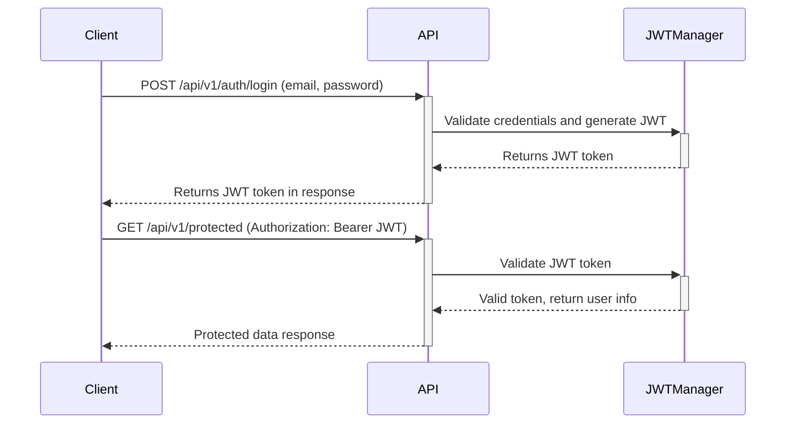

Voici la traduction en français du texte, en conservant les codes et les termes techniques en anglais :

### Tâche : Implémenter l'authentification JWT avec `flask-jwt-extended`

#### Objectif
Mettre en place une authentification basée sur JWT pour l'application HBnB, permettant une fonctionnalité de connexion sécurisée. Cette tâche implique la configuration de l'API pour générer et vérifier les tokens JWT en utilisant l'extension `flask-jwt-extended`. Les tokens seront émis lors d'une connexion réussie et seront nécessaires pour accéder aux points de terminaison protégés.

#### Contexte
JWT (JSON Web Token) permet une authentification sécurisée en fournissant un token que les clients peuvent utiliser pour accéder aux ressources protégées sans avoir à se ré-authentifier à chaque requête. JWT est sans état, ce qui signifie que le serveur n'a pas besoin de stocker les sessions utilisateur, le rendant idéal pour les applications évolutives. Les tokens JWT permettent également d'intégrer des revendications supplémentaires (comme les rôles d'utilisateur), ce qui est utile pour l'autorisation.

Dans cette tâche, nous allons mettre en place la connexion des utilisateurs, émettre des tokens JWT et utiliser ces tokens pour protéger des points de terminaison spécifiques de l'API.

Voici un **diagramme Mermaid.js** qui montre l'interaction entre le client et l'API pour obtenir un token JWT et l'utiliser pour faire des requêtes authentifiées :

##### Ajout d'un Middleware
Dans Flask, un **middleware** est un logiciel qui se situe entre la requête et le traitement final de cette requête par vos routes Flask. Le middleware peut manipuler les requêtes, les réponses, ou les deux. Dans le contexte de l'authentification JWT, le middleware est responsable de la vérification du token JWT avec chaque requête entrante.

Flask-JWT-Extended fournit des décorateurs comme `@jwt_required()` qui agissent comme middleware, assurant qu'un token valide est présent avant d'autoriser l'accès aux ressources protégées.

- **Que fait le middleware dans JWT ?** : Le middleware intercepte la requête et vérifie si le token est présent et valide. Si le token est invalide ou manquant, le middleware empêche la requête d'atteindre le gestionnaire de route et renvoie à la place une réponse d'erreur.

- **Comment Flask-JWT-Extended gère-t-il cela ?** : Flask-JWT-Extended utilise des décorateurs tels que `@jwt_required()` et `@jwt_optional()`. Ces décorateurs s'assurent que les routes protégées ne sont accessibles que si l'utilisateur a un token valide.

[Le reste du texte suit le même format, avec les instructions, les explications et les exemples de code en anglais]

#### Ressources
- **Authentification JWT** : [JWT.io](https://jwt.io/)
- **Documentation Flask-JWT-Extended :** [Flask-JWT-Extended](https://flask-jwt-extended.readthedocs.io/en/stable/)
- **Meilleures pratiques JWT :** [OWASP JWT Security](https://cheatsheetseries.owasp.org/cheatsheets/JSON_Web_Token_Cheat_Sheet_for_Java.html)

#### Résultat attendu
À la fin de cette tâche, les étudiants auront implémenté une fonctionnalité de connexion utilisateur utilisant JWT. Ils seront capables de générer et de vérifier des tokens JWT, de protéger des points de terminaison spécifiques de l'API, et d'intégrer des revendications (comme `is_admin`) dans le token pour de futures vérifications d'autorisation.

Citations:
[1] https://ppl-ai-file-upload.s3.amazonaws.com/web/direct-files/29334386/291a854c-0a77-41d3-9977-12a743a23372/paste.txt
